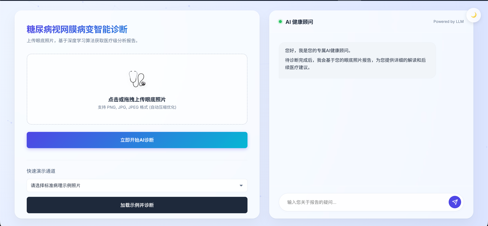
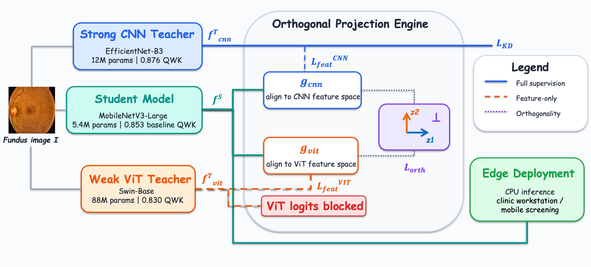

# OrthKD：面向基层慢病筛查的轻量化 DR 分级与跨域稳健决策平台

> 🏆 中国机器人及人工智能大赛 · 人工智能创新赛 · 全国一等奖作品

本项目面向基层糖尿病视网膜病变（Diabetic Retinopathy，DR）辅助筛查，基于 **OrthKD 正交特征知识蒸馏**，将异构教师模型的互补知识迁移到轻量化学生模型，在降低模型规模的同时改善跨数据集的分级表现。

我们希望让眼底 AI 筛查更适合基层工作站和移动筛查场景：通过眼底图像上传、DR 五级分级与转诊风险提示，辅助医生完成初筛和复核。

**本仓库收录获奖作品的国赛汇报、系统截图和相关论文，当前未包含训练代码、模型权重及本地部署脚本。**

[演示入口](https://huggingface.co/spaces/alexchenc10/aicomp_demo) · [国赛汇报](CRAIC国赛汇报.pptx) · [OrthKD 论文](paper2.pdf) · [相关研究论文](paper1.pdf)

## 项目背景

基层眼底筛查面临专科阅片资源不足、终端算力有限，以及不同设备和地区带来的图像分布差异。大型模型难以直接部署到资源受限的终端，而单纯压缩模型又可能削弱分级能力和跨域泛化表现。

OrthKD 关注的问题是：**当不同教师模型的预测可靠性存在差异时，如何保留它们的互补知识，而不把不可靠的决策信号一并传给学生模型？**

## 系统展示

原型展示了眼底图像上传、示例图像加载，以及报告相关的 AI 健康顾问交互入口。国赛汇报中的核心应用流程为：

1. **上传图像**：输入待筛查的眼底照片。
2. **AI 分级**：由 MobileNetV3-Large 学生模型输出 0 至 4 级 DR 分级结果。
3. **风险提示**：提供可转诊 DR（referable DR）的风险参考，辅助高风险病例分流。
4. **医生复核**：医生结合模型结果和实际情况确认后续处理建议。

演示地址来自国赛汇报材料，可通过上方链接访问。

## 核心技术

### 异构教师的选择性知识迁移

OrthKD 为两个教师分配不同的监督职责：

| 模型 | 角色 | 传递给学生的知识 |
| --- | --- | --- |
| EfficientNet-B3 | 强 CNN 教师，约 12M 参数 | 预测分布与特征，提供决策监督和局部视觉信息 |
| Swin-Base | Transformer 教师，约 88M 参数 | 仅传递特征，补充全局结构信息，不使用其 logits 监督学生 |
| MobileNetV3-Large | 轻量学生，约 **5.4M 参数** | 学习两类教师的互补信息，作为部署模型 |

这里的“强”“弱”描述的是论文实验配置下的教师表现。框架通过区分预测监督与特征监督，利用 Transformer 的补充信息，同时限制其较不可靠的预测信号对学生决策的影响。

### 正交特征约束

学生特征通过两个投影头分别对齐 CNN 和 Transformer 的特征空间。训练时，对两个投影施加正交约束，减少重复信息，鼓励学生同时学习局部病灶线索与全局结构线索。

教师模型用于训练阶段的知识迁移，部署阶段使用轻量学生模型。项目同时结合 Grad-CAM 可视化与典型病例分析，辅助理解模型的关注区域及跨域表现。

## 实验结果

以下结果摘自仓库中的 [OrthKD 论文](paper2.pdf)。QWK 为二次加权 Kappa，用于衡量有序分级的一致性；AUC 为论文中的可转诊 DR 任务指标；ECE 为预期校准误差。

### 域内评估

| 数据集 | 学生基线 QWK ↑ | OrthKD QWK ↑ | OrthKD AUC ↑ | OrthKD ECE ↓ |
| --- | ---: | ---: | ---: | ---: |
| EyePACS | 0.853 | **0.885** | 0.966 | 0.023 |
| APTOS | 0.934 | **0.952** | 0.995 | 0.018 |

### 外部数据集零样本验证

| 方法 | Messidor-2 QWK ↑ | IDRiD QWK ↑ |
| --- | ---: | ---: |
| EfficientNet-B3 教师 | 0.785 | 0.749 |
| MobileNetV3 学生基线 | 0.507 | 0.516 |
| B3-Only KD | 0.587 | 0.701 |
| 双教师特征蒸馏，无正交约束 | 0.654 | 0.724 |
| **OrthKD** | **0.728** | **0.743** |

外部验证不进行目标数据集专属的阈值调优或校准。OrthKD 将 Messidor-2 上的学生基线 QWK 从 **0.507 提升至 0.728**，在 IDRiD 上达到 **0.743**，接近强教师的 0.749，体现了轻量化模型的跨域泛化潜力。

论文报告的是单次运行结果，尚未提供多随机种子的置信区间；真实基层场景的前瞻性验证属于后续工作。

## 获奖与研究成果

- **竞赛荣誉**：中国机器人及人工智能大赛人工智能创新赛全国一等奖。
- **核心研究**：*OrthKD: Extracting Generalized Clinical Knowledge from Heterogeneous Teachers for Lightweight Deployment*。国赛汇报材料记载，该论文已被 **IJCAI 2026** 接收。全文见 [paper2.pdf](paper2.pdf)。
- **相关研究**：*If You Hear It, Help Find It: Orthogonal Knowledge Distillation for Open-Vocabulary Audio-Visual Event Localization*。国赛汇报材料记载，该论文已被 **ACM Multimedia 2026** 接收。全文见 [paper1.pdf](paper1.pdf)。该研究将正交知识蒸馏思想用于开放词汇音视频事件定位。

## 仓库内容

| 文件 | 内容 |
| --- | --- |
| [CRAIC国赛汇报.pptx](CRAIC国赛汇报.pptx) | 国赛汇报，包含研究背景、核心技术、应用展示与后续规划 |
| [f1.png](f1.png) | DR 辅助筛查原型界面截图 |
| [f2.png](f2.png) | OrthKD 技术架构图 |
| [paper2.pdf](paper2.pdf) | 轻量化 DR 分级与跨域泛化的 OrthKD 核心论文 |
| [paper1.pdf](paper1.pdf) | 正交知识蒸馏在音视频事件定位中的相关研究论文 |
| [LICENSE](LICENSE) | Apache License 2.0 许可文本 |

了解作品可先浏览系统截图和架构图，再阅读国赛汇报；算法细节、实验设置及完整结果请参阅 OrthKD 论文。

## 后续方向

- 扩展教师组合，验证正交约束在更多 CNN 与 Transformer 组合下的稳定性。
- 结合量化、剪枝和蒸馏后校准，进一步降低终端推理延迟与内存占用。
- 开展真实基层筛查流程验证，记录图像质量、医生复核结果和转诊结局。
- 增加病灶区域提示与不确定性评分，支持医生理解和复核模型结果。

## 使用说明与许可

本项目定位为研究与辅助筛查原型，模型分级、风险提示及健康顾问输出用于辅助参考，最终诊断和处理建议由医生确认。

仓库提供 [Apache License 2.0](LICENSE) 许可文本。
